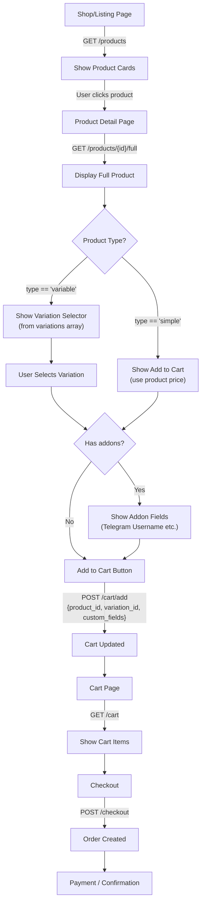

# WooCommerce Frontend API Documentation

**Base URL**: `https://your-api.com/api/v1/wordpress/wc`

> [!IMPORTANT]
> For **product pages**, always use `/products/{id}/full` — NOT `/products/{id}`.
> The basic endpoint does NOT return variations, attributes, or addon fields.

---

## 1. Products (Public — No Auth Required)

### List Products
```
GET /products?skip=0&limit=10&status=publish&category=17&search=robot&min_price=10&max_price=500&on_sale=true
```

| Param | Type | Description |
|-------|------|-------------|
| `skip` | int | Pagination offset (default: 0) |
| `limit` | int | Page size, max 100 (default: 10) |
| `status` | string | `publish` (default) |
| `category` | int | Filter by category term ID |
| `tag` | int | Filter by tag term ID |
| `search` | string | Search in product name/description |
| `min_price` | decimal | Minimum price filter |
| `max_price` | decimal | Maximum price filter |
| `on_sale` | bool | Only products on sale |
| `featured` | bool | Only featured products |

**Response**: Array of `ProductRead` objects (see schema below)

---

### Search Products
```
GET /products/search?q=mentorship&limit=10
```

---

### Get Product by Slug
```
GET /products/slug/{slug}
```

---

### ⭐ Get Full Product Details (USE THIS ON PRODUCT PAGE)
```
GET /products/{product_id}/full
```

**This is the endpoint the frontend MUST use on the product detail page.** It returns everything: variations, attributes, addon fields, related products.

**Response** — `ProductFullRead`:
```json
{
  "id": 322,
  "name": "VIP Mentorship / Tutorials",
  "slug": "vip-mentorship-tutorials",
  "type": "variable",
  "sku": "",
  "price": "499.99",
  "regular_price": "1590",
  "sale_price": "499.99",
  "description": "...",
  "short_description": "",
  "status": "publish",
  "manage_stock": false,
  "stock_quantity": null,
  "stock_status": "instock",
  "weight": null,
  "virtual": true,
  "downloadable": false,
  "seller_payment_link": "https://selar.co/...",
  "whop_payment_link": "https://whop.com/...",
  "date_created": "2021-07-06T20:08:38",
  "date_modified": "2026-01-01T18:19:39",
  "dimensions": { "length": null, "width": null, "height": null },
  "average_rating": "0.00",
  "rating_count": 0,
  "total_sales": 97,
  "featured_image": {
    "id": 21611,
    "url": "https://mrpfx.com/wp-content/uploads/...",
    "title": "...",
    "alt_text": "",
    "caption": ""
  },
  "gallery_images": [],
  "categories": [
    { "id": 17, "name": "VIP", "slug": "vip", "parent": 0, "count": 11 }
  ],
  "tags": [],
  "attributes": [
    {
      "id": 0,
      "name": "Duration",
      "slug": "duration",
      "position": 0,
      "visible": true,
      "variation": true,
      "options": ["1 Month", "Lifetime"]
    }
  ],
  "variations": [
    {
      "id": 61946,
      "sku": null,
      "price": "49.99",
      "regular_price": "49.99",
      "sale_price": null,
      "stock_quantity": null,
      "stock_status": "instock",
      "manage_stock": false,
      "weight": null,
      "dimensions": { "length": null, "width": null, "height": null },
      "attributes": [{ "name": "duration", "option": "1-month" }],
      "date_created": "...",
      "date_modified": "...",
      "description": "",
      "status": "publish"
    },
    {
      "id": 61947,
      "sku": null,
      "price": "299.99",
      "regular_price": "299.99",
      "sale_price": "249.99",
      "stock_quantity": null,
      "stock_status": "instock",
      "manage_stock": false,
      "weight": null,
      "dimensions": { "length": null, "width": null, "height": null },
      "attributes": [{ "name": "duration", "option": "lifetime" }],
      "date_created": "...",
      "date_modified": "...",
      "description": "",
      "status": "publish"
    }
  ],
  "addons": [
    {
      "name": "Telegram Username",
      "type": "text",
      "required": true,
      "placeholder": "@yourusername",
      "description": "Enter your Telegram username",
      "options": [],
      "position": 0,
      "max_length": null
    }
  ],
  "related_ids": [],
  "upsell_ids": [],
  "cross_sell_ids": []
}
```

---

### Get Basic Product (no variations/addons)
```
GET /products/{product_id}
```
Returns `ProductRead` only — no `variations`, `attributes`, or `addons`. Use for listing pages, NOT product detail pages.

---

## 2. Product Categories (Public)

### List Categories
```
GET /categories?parent=0&skip=0&limit=20
```

### Get Single Category
```
GET /categories/{category_id}
```

---

## 3. Product Tags (Public)

### List Tags
```
GET /tags?skip=0&limit=20
```

---

## 4. Product Variations (Public)

### Get Variations for a Product
```
GET /products/{product_id}/variations
```
Returns array of variation objects. Already included in `/products/{id}/full` — use this only if you need variations separately.

---

## 5. Product Attributes (Public)

### Get Attributes for a Product
```
GET /products/{product_id}/attributes
```

---

## 6. Product Addons / Custom Fields (Public)

### Get Addon Fields
```
GET /products/{product_id}/addons
```
Returns the custom input fields (e.g., Telegram Username). Already included in `/products/{id}/full`.

---

## 7. Product Images (Public)

### Get Product Images
```
GET /products/{product_id}/images
```

---

## 8. Product Reviews (Public + Auth)

### Get Reviews for a Product
```
GET /products/{product_id}/reviews?skip=0&limit=50
```

### Submit a Review (🔒 Auth Required)
```
POST /products/{product_id}/reviews
Authorization: Bearer <token>
```
```json
{
  "rating": 5,
  "review": "This mentorship changed my trading game!"
}
```

---

## 9. Shopping Cart (🔒 Auth Required)

All cart endpoints require `Authorization: Bearer <token>` header.

### Get Cart
```
GET /cart
```
**Response**:
```json
{
  "user_id": 123,
  "items": [
    {
      "product_id": 322,
      "variation_id": 61947,
      "quantity": 1,
      "product_name": "VIP Mentorship / Tutorials - Lifetime",
      "product_price": 249.99,
      "line_total": 249.99,
      "product_image": null,
      "seller_payment_link": "https://selar.co/...",
      "whop_payment_link": "https://whop.com/..."
    }
  ],
  "subtotal": 249.99,
  "discount_total": 0,
  "shipping_total": 0,
  "tax_total": 0,
  "total": 249.99,
  "item_count": 1,
  "coupon_codes": []
}
```

### Add to Cart
```
POST /cart/add
```
```json
{
  "product_id": 322,
  "variation_id": 61947,
  "quantity": 1,
  "custom_fields": {
    "Telegram Username": "@myusername"
  }
}
```

> [!IMPORTANT]
> For **variable products**, you MUST include `variation_id`. Without it, the parent product price (which may be 0) gets used.

### Update Cart Item
```
PUT /cart/update
```
```json
{
  "product_id": 322,
  "variation_id": 61947,
  "quantity": 2
}
```
Set `quantity: 0` to remove the item.

### Remove from Cart
```
DELETE /cart/remove/{product_id}?variation_id=61947
```

### Clear Cart
```
DELETE /cart/clear
```

### Apply Coupon
```
POST /cart/coupon
```
```json
{ "coupon_code": "SAVE20" }
```

### Remove Coupon
```
DELETE /cart/coupon/{coupon_code}
```

---

## 10. Checkout (🔒 Auth Required)

### Create Order from Cart
```
POST /checkout
```
```json
{
  "billing_address": {
    "first_name": "John",
    "last_name": "Doe",
    "address_1": "123 Main St",
    "city": "Lagos",
    "state": "LA",
    "postcode": "100001",
    "country": "NG",
    "email": "john@example.com",
    "phone": "+2341234567890"
  },
  "use_same_for_shipping": true,
  "payment_method": "nowpayments",
  "payment_method_title": "Crypto Payment",
  "customer_note": "Please deliver fast",
  "coupon_codes": ["SAVE20"],
  "custom_fields": {
    "Telegram Username": "@myusername"
  }
}
```

**Response**:
```json
{
  "order_id": 12345,
  "order_key": "wc_order_abc123",
  "order_status": "pending",
  "total": 249.99,
  "payment_url": null,
  "redirect_url": null,
  "message": "Order created successfully"
}
```

---

## 11. User Orders (🔒 Auth Required)

### My Orders
```
GET /orders/my?skip=0&limit=10
```

### My Order Summary
```
GET /orders/my/summary
```
```json
{
  "total_orders": 5,
  "total_spent": 1249.95,
  "pending_orders": 1,
  "processing_orders": 0,
  "completed_orders": 4
}
```

### Get Specific Order
```
GET /orders/my/{order_id}
```

---

## 12. Admin Endpoints (🔒 Auth Required)

These endpoints require authentication and are for admin/backend use.

### Products
| Method | Endpoint | Description |
|--------|----------|-------------|
| `POST` | `/products` | Create product |
| `PUT` | `/products/{id}` | Update product |
| `DELETE` | `/products/{id}?force=false` | Trash/delete product |
| `POST` | `/products/{id}/terms` | Assign categories/tags |
| `DELETE` | `/products/{id}/terms` | Remove categories/tags |

### Variations
| Method | Endpoint | Description |
|--------|----------|-------------|
| `POST` | `/products/{id}/variations` | Create variation |
| `PUT` | `/products/{id}/variations/{vid}` | Update variation |
| `DELETE` | `/products/{id}/variations/{vid}` | Delete variation |

### Addons
| Method | Endpoint | Description |
|--------|----------|-------------|
| `PUT` | `/products/{id}/addons` | Set/replace addon fields |
| `DELETE` | `/products/{id}/addons` | Remove all addon fields |

### Categories
| Method | Endpoint | Description |
|--------|----------|-------------|
| `POST` | `/categories` | Create category |
| `PUT` | `/categories/{id}` | Update category |
| `DELETE` | `/categories/{id}` | Delete category |

### Images
| Method | Endpoint | Description |
|--------|----------|-------------|
| `PUT` | `/products/{id}/images/featured` | Set featured image |
| `PUT` | `/products/{id}/images/gallery` | Replace gallery |
| `POST` | `/products/{id}/images/gallery` | Add to gallery |
| `DELETE` | `/products/{id}/images/gallery/{attachment_id}` | Remove from gallery |

### Orders (Admin)
| Method | Endpoint | Description |
|--------|----------|-------------|
| `GET` | `/orders?skip=0&limit=10` | List all orders |
| `GET` | `/orders/{id}` | Get order details |
| `POST` | `/orders` | Create order manually |
| `PUT` | `/orders/{id}` | Update order status |

### Customers (Admin)
| Method | Endpoint | Description |
|--------|----------|-------------|
| `GET` | `/customers?skip=0&limit=10` | List customers |
| `GET` | `/customers/{id}` | Get customer |

---

## Frontend Integration Flowchart



---

## Key Rules for Frontend

> [!CAUTION]
> **These are the most common mistakes — follow them strictly.**

1. **Product pages MUST call `/products/{id}/full`** — the basic `/products/{id}` does NOT return variations, addons, or attributes.

2. **Variable products MUST send `variation_id` when adding to cart** — otherwise the cart uses the parent product price (which may be $0).

3. **Check `type` field** — if `type == "variable"`, show a variation selector from the `variations` array. If `type == "simple"`, use the product's own price.

4. **Addon fields are REQUIRED inputs** — if `addons` array is not empty, render input fields. Check `required: true` and validate before add-to-cart.

5. **Use `seller_payment_link` and `whop_payment_link`** — if these exist on the product or cart item, they are the external payment URLs for the product.

6. **Variation price display** — show the variation's `price`. If `sale_price` exists, show it as the current price with `regular_price` struck through.

7. **Cart item shows variation name** — `product_name` in the cart will include the variation attribute (e.g., "VIP Mentorship - Lifetime").
